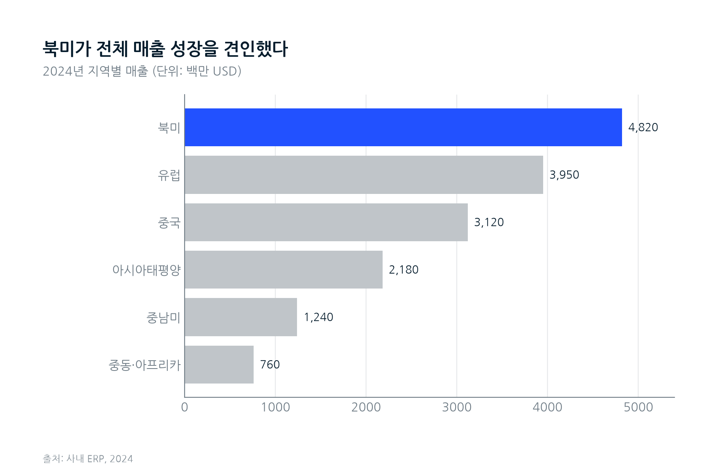

# data-chart — 편집 가능한 컨설팅급 차트 Claude Skill

CSV/XLSX 데이터를 붙여넣으면 **McKinsey·Economist·BCG 스타일의 차트(SVG)** 를
만들어주는 Claude Code 스킬입니다. 폭스바겐그룹코리아 임직원 에이전트 강의용으로
제작되었습니다.

## 왜 이 스킬인가

일반적으로 LLM에게 차트를 요청하면 **첫 결과는 괜찮지만, "수정"을 요청하면
처음부터 다시 그리면서 오히려 더 망가지는** 문제가 있습니다.

이 스킬은 차트를 **세 개의 파일로 분리**해 그 문제를 구조적으로 해결합니다.

| 파일 | 역할 | 수정 대상 |
|------|------|-----------|
| `data.csv`  | 정규화된 데이터 | 데이터가 바뀔 때만 |
| `spec.yaml` | 차트의 모든 시각적 결정(종류·제목·색·강조·출처…) | **이 파일만 고치면 됩니다** |
| `chart.svg` | 렌더 결과물 | 손대지 않고 재생성 |

> **수정 방법 = `spec.yaml`의 해당 항목만 고치고 다시 렌더.**
> 처음부터 다시 그리지 않으므로 "수정할수록 망가지는" 현상이 사라집니다.

## 특징

- **컨설팅·출판물 품질**: 결론형 제목(action title), 1색 강조 + 나머지 회색,
  직접 라벨링, 차트정크 제거, 출처 라인 — Tufte / *Storytelling with Data* /
  FT Visual Vocabulary 원칙을 기본값으로 내장.
- **테마 4종**: `mckinsey`(기본), `economist`, `consulting`(BCG), `ft`.
  팔레트는 ggthemes/highcharter·bcggtheme·o-colors 등 인코딩된 출처에서 추출
  (출처는 `references/style-guide.md`).
- **한글 100% 지원**: NanumGothic 폰트를 번들하고 SVG에 글자를 벡터 패스로
  임베드(`svg.fonttype=path`) → 어떤 뷰어에서도 □□□(깨짐) 없음.
- **차트 11종**: bar · hbar · grouped_bar · stacked_bar · stacked_bar_100 ·
  line · waterfall · slope · dumbbell · scatter · pie/donut.
- **SVG 출력** → PowerPoint(Microsoft 365)에 그대로 삽입. `--png`로 미리보기.

## 설치

이 저장소를 클론하면 스킬이 `.claude/skills/data-chart/` 에 포함되어 있어,
Claude Code가 자동으로 인식합니다. 의존성만 한 번 설치하세요:

```bash
pip install pandas matplotlib pyyaml openpyxl
```

## 사용법 (Claude Code에서)

그냥 데이터를 붙여넣고 자연어로 요청하면 됩니다:

```
이 데이터로 지역별 매출 막대차트 만들어줘
[북미 4820, 유럽 3950, 중국 3120, ...]
```
→ Claude가 `data.csv` + `spec.yaml`을 만들고 차트를 렌더합니다.

수정도 자연어로:
```
북미를 빨간색으로 강조하고, 제목을 "북미가 성장을 견인했다"로 바꿔줘
McKinsey 테마로 바꿔줘
```
→ Claude는 `spec.yaml`의 해당 필드만 고치고 다시 렌더합니다(안정적).

### 직접 CLI로 실행

```bash
# 1) 데이터 정규화
python3 .claude/skills/data-chart/scripts/ingest.py --in raw.xlsx --out charts/sales/data.csv

# 2) spec.yaml 작성 후 렌더
python3 .claude/skills/data-chart/scripts/render.py \
  --data charts/sales/data.csv --spec charts/sales/spec.yaml \
  --out charts/sales/chart --png
```

## 예시

`examples/`(스킬 폴더 내)에 동작 예시가 들어 있습니다:
`sales.csv` + `sales.spec.yaml` → `sales.svg`.



## 구조

```
.claude/skills/data-chart/
├── SKILL.md              # Claude가 따르는 메인 지침(워크플로우 + 수정 규칙)
├── scripts/              # render.py · themes.py · fonts.py · ingest.py
├── references/           # chart-types.md · style-guide.md · spec-schema.md (리서치)
├── assets/fonts/         # NanumGothic (OFL 라이선스)
└── examples/             # 데모 데이터·스펙·결과
```

## 리서치 근거

차트 선택·디자인 원칙·팔레트의 출처는 다음 문서에 정리되어 있습니다:

- `references/chart-types.md` — FT Visual Vocabulary 9개 메시지 카테고리별 차트 선택
- `references/style-guide.md` — 컨설팅/출판물 디자인 원칙 + 4사 팔레트 hex(출처 포함)

주요 출처: FT chart-doctor Visual Vocabulary, *Storytelling with Data*(Knaflic),
*Say It With Charts*(Zelazny), Tufte, BBC bbplot, ggthemes/highcharter·bcggtheme·
o-colors 팔레트 패키지.

## 라이선스

- 코드: 자유 사용(사내 강의/실무용).
- 번들 폰트 NanumGothic: SIL Open Font License 1.1
  (`.claude/skills/data-chart/assets/fonts/LICENSE.md`).
